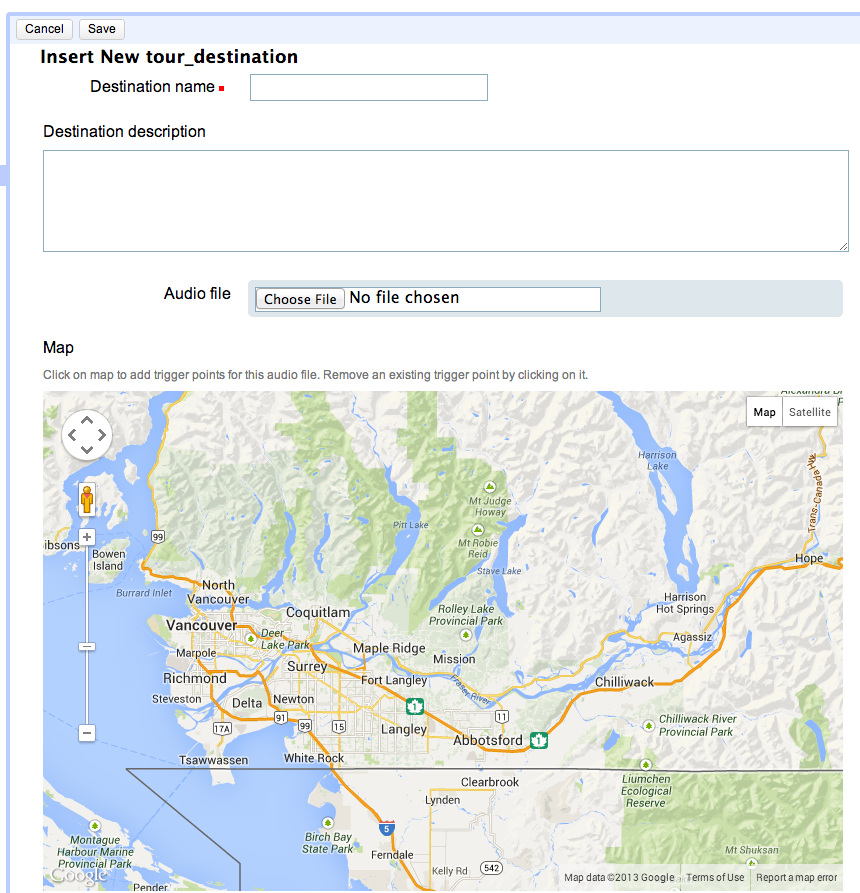
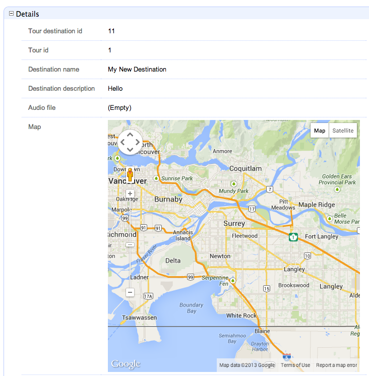

# Google Maps Xataface Module
> A map widget for Xataface forms

The google maps module adds a "map" widget to your Xataface apps that can be used to allow users to add points on maps and have the data stored in a TEXT field as JSON data.  Currently users can manipulate the map center and zoom, as well as add and remove markers on the map.

## Requirements

1. [Xataface](http://xataface.com) 2.0.4 or higher (or the latest [Git Repo](https://github.com/shannah/xataface))
2. A [Google Maps API key](https://developers.google.com/maps/documentation/javascript/tutorial#api_key) (if using on domains other than localhost).

## Installation

##### Create `modules` directory if it doesn't exist

In your existing Xataface application directory (not the xataface directory, but your application's directory), create a "modules" folder if it doesn't already exist:
 
```
$ cd /path/to/app
$ mkdir modules
$ cd modules
```

##### Copy `google_maps` module into your modules directory

Clone the google_maps module repository into the modules directory so that it is located at `/path/to/app/modules/google_maps`:

```
$ git clone https://github.com/shannah/xataface-module-google-maps.git google_maps
```

Alternatively you could have just downloaded the ZIP file and copied it into the same location.  Your application file structure should now be something like:

	app/
		index.php
		conf.ini
		modules/
			google_maps/
				google_maps.php
				widget.php
				version.txt
				…
				

##### Enable module in your app's `conf.ini` file

In your application's conf.ini file's `[_modules]` section, add the following line:

```
modules_google_maps=modules/google_maps/google_maps.php
```

i.e. Your `[_modules]` section will look like:

```
[_modules]
	modules_google_maps=modules/google_maps/google_maps.php
	… other modules entries …
```

##### Add your Google API Key to the conf.ini file

After you have [obtained your API key](https://developers.google.com/maps/documentation/javascript/tutorial#api_key), add the following section to your `conf.ini` file:

```
[modules_google_maps]
	key="YOUR KEY HERE"
```

(But, of course, replace "YOUR KEY HERE" with your actual key).

## Usage

After you have installed the module, you should be able to use the map widget to edit any TEXT field in your database by simply specifying `widget:type=map` in the `fields.ini` file.

For example, suppose I have the following table:

```
create table destinations (
	destination_id int(11) unsigned not null auto_increment,
	name varchar(100),
	map TEXT
)
```

Then in your `tables/destinations/fields.ini` file you could add:

```
[map]
	widget:type=map
```

Now, if try to create a new record in the `destinations` table via your Xataface application, you should notice that there is now a Google map widget where the `map` field is displayed (as shown below):



Additionally, if you save the record, you'll notice that the map zoom and position is retained on the edit form.  Essentially this is the information that is saved in the actual `map` field in the database (i.e. the map center and zoom values).  Other information may also be manipulated and persisted, such as markers.  See the later section on Markers for more information about adding and removing markers on maps.

Notice, also, that if you visit details view for a record, it will show you the map as it was set up in the edit form.



## Storage Format

The data from the map is stored as a JSON object inside the field that is specified to use the map widget.  It is best to use a TEXT field for this storage, however, other field types that can store text will also work (e.g. VARCHAR or BLOB).  The storage format will likely be expanded as more features are added, but, at a minimum, it will store the zoom setting and the map center as follows:

```
{
	"center":[49.14575029369235,237.17499313354497],
	"zoom":10
}
```

The `center` attribute is a 2-element array where the first index stores the latitude and the second stores the longitude.

If you have enabled markers, then the marker information will also be stored.  E.g.

```
{
	"center":[49.14575029369235,-122.82500686645506],
	"zoom":10,
	"nextMarkerId":3,
	"markers":
	{
		"0": {
			"id":"0",
			"position":[49.22156344448291,-123.01528930664062]
		},
		"1": {
			"id":"1",
			"position":[49.165023578693386,-123.13064575195312]
		},
		"2":{
			"id":"2",
			"position":[49.17759357813296,-122.85186767578125]
		}
	}
}
```

Notice the additional `markers` property in the root JSON object.  It is simply an object with integer keys (which correspond with the marker id), and objects encapsulating each marker.

Each marker is stored as an object with an `id` property (an integer) and a `position` property which is a latitude/longitude pair.  Additional properties may be added as features are added, but these properties will be there at a minimum.

## Markers

The google maps module also allows you to add and remove markers from maps.  Currently this functionality is very primitive:  Clicking on the map will add a marker at the point clicked.  Clicking on a marker will remove the marker.  If you save the form, the markers will be retained.  See the "Storage Format" section above for details on how the markers are stored in your database.

By default, markers and disabled.  You will need to enable them by adding the following directives to the fields.ini file for your field:
```
widget:atts:data-map-add-markers=1
widget:atts:data-map-remove-markers=1
```

You also need to ensure that your user has been granted the `google_maps_addMarker` and `google_maps_removeMarker` permissions or they won't be able to add/remove markers.  


## Support

Visit the [Xataface Forum](http://xataface.com/forum) for support.

	

